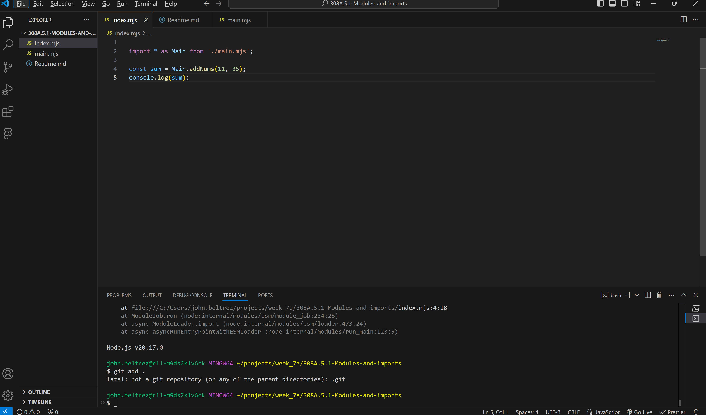
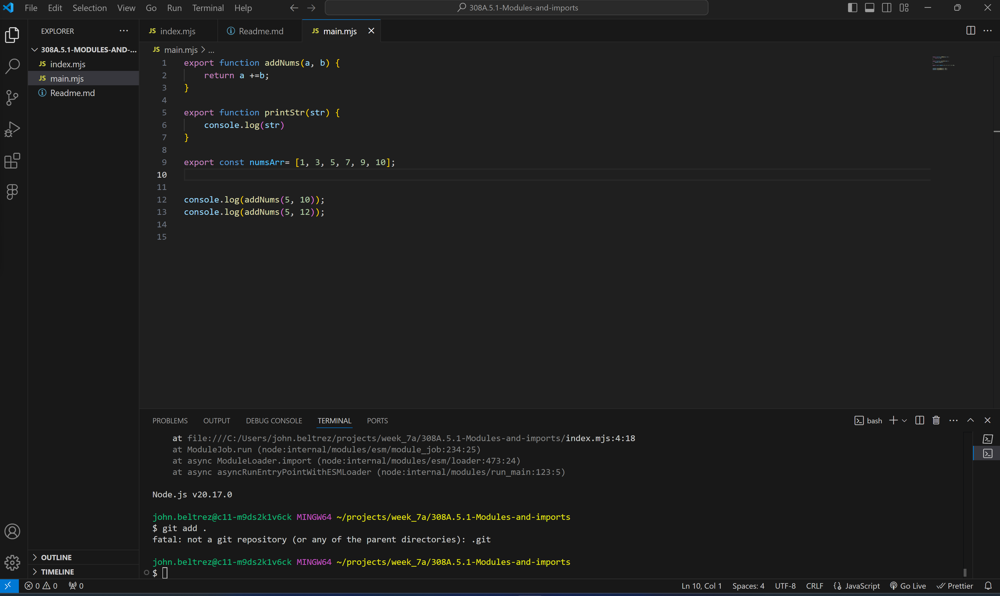

# 308A.5.1-Modules-and-imports

# Modules and Imports

In this lab, I use the export and import syntax to be able to use things like functions and variables created within one js file inside of another js file. 

On a bigger project, implementing this tool will prove to be more valuable in order to stay organized and continue to use reusable functions. 

## Screenshots

